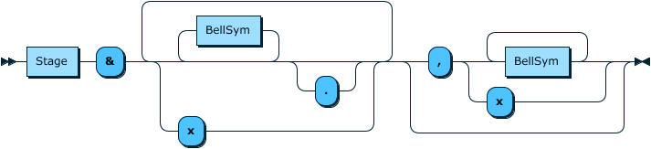

# HundredWeight

A programme written in PureScript for the creation of ringing diagrams from place notation and possibly more in the future.

This started off as an exercise for myself to learn Haskell/PureScript, parsers, optics and place notation in one fell swoop.

## Grammar

For those who need an intro, a handy guide to place notation can be found [here](https://rsw.me.uk/blueline/methods/notation).

The syntax for place notation parsed by this tool is shown in this handy diagram below:



Image created using the railroad diagram creator found [here](https://www.bottlecaps.de/rr/ui).

``` EBNF

PlaceNotation ::= Stage '&' (((BellSym)* ('.')?) | 'x')+ (',' (BellSym+ | 'x'))?

```

Stage is a natural number of 3 or above that dictates the number of bells in the method. the & symbol is used to separate the stage from the beginning of the rest of the notation.

BellSym is a character symbol to denote each bell. By convention, bells 1-9 are denoted by the corresponding natural numbers whilst numbers above nine are denoted by a capital letter of the alphabet starting with A for 10.

A comma is used to denote a reflection point. The last set of places in front of the comma are treated as the half-lead and the places after form the lead end.

Note that the parser will ignore whitespace.

For example, the place notation for little bob royal is as follows:

``` PlaceNotation

12 & x A x E , C

```
